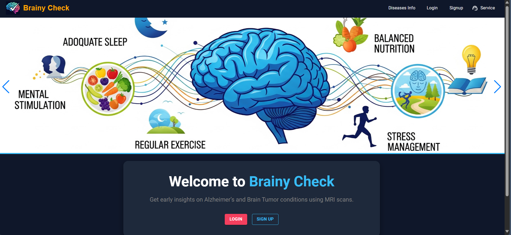
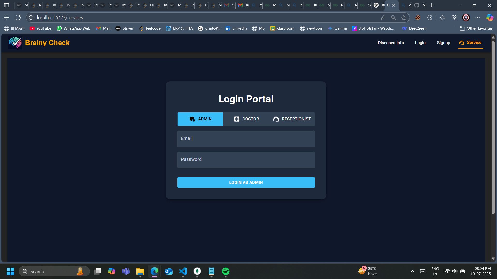
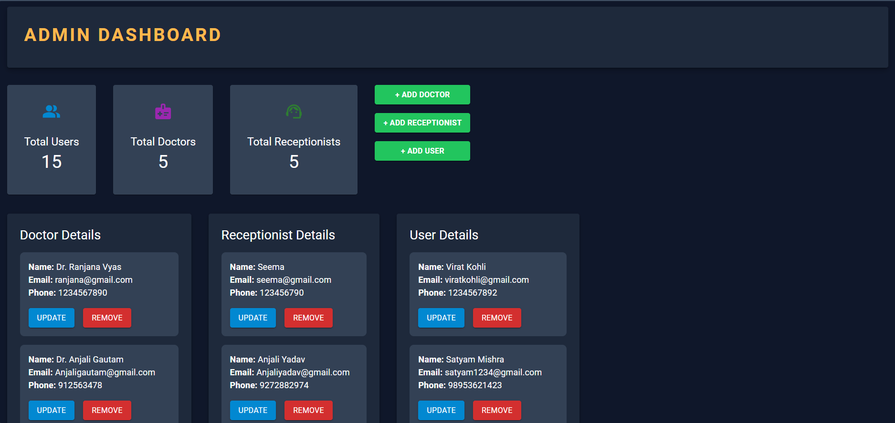
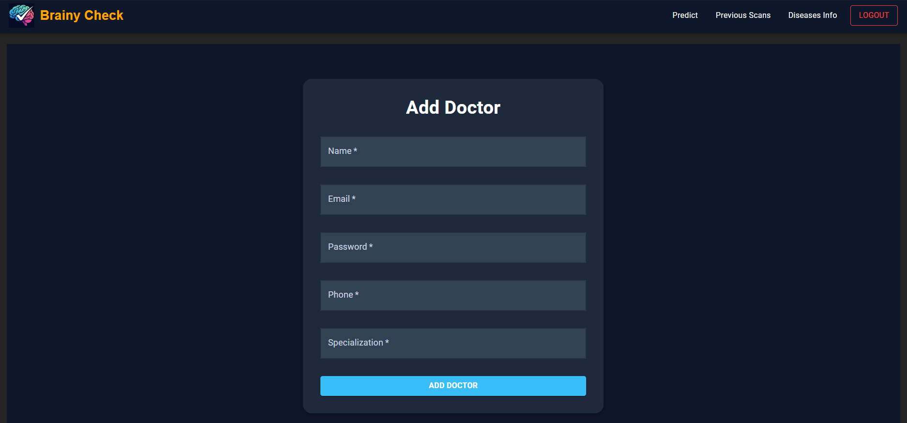
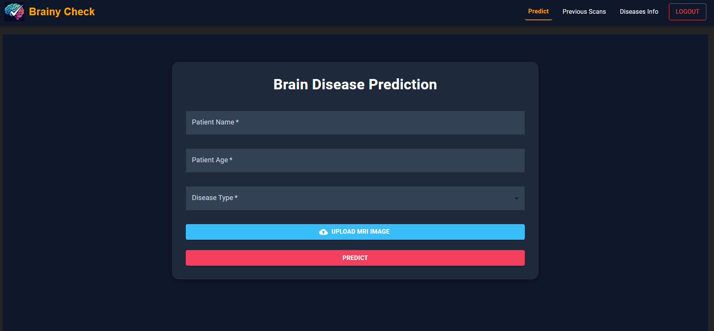
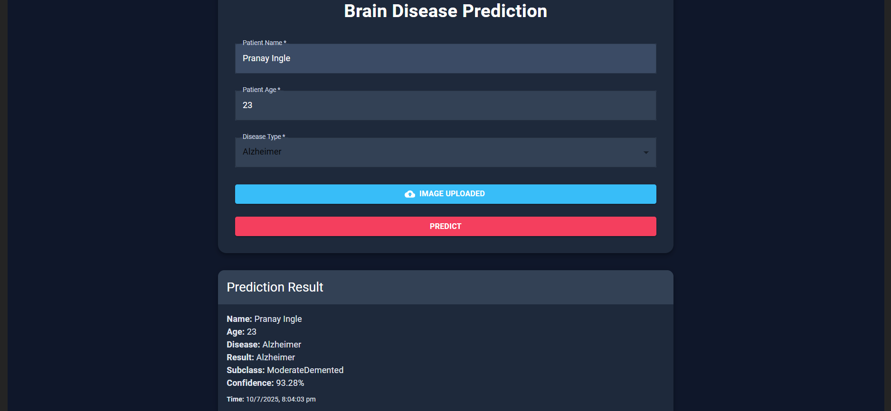
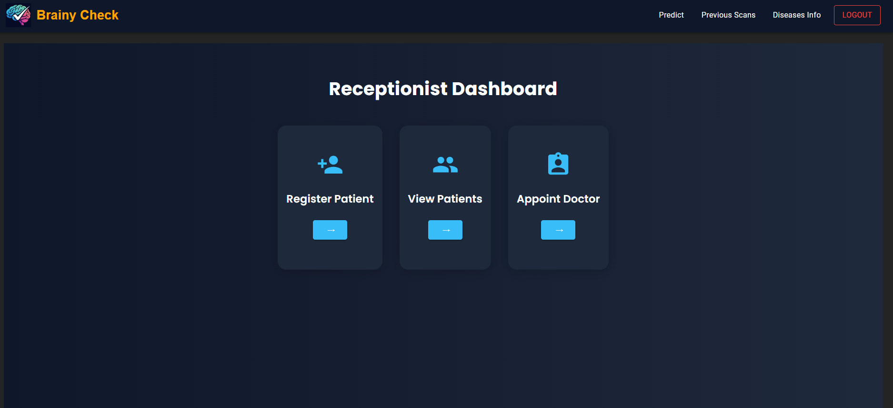

# 🧠 Brainy Check

Brainy Check is a full-stack AI-powered web application for early detection of **Alzheimer’s Disease** and **Brain Tumors** from MRI scans. It features a prediction system using deep learning, along with role-based dashboards for Admins, Doctors, and Receptionists.






---

## 🚀 Live Demo

> 🔗 [Visit Live on Render](https://brainycheck.onrender.com) *(replace with your link)*

---

## 🖼️ Preview

### 👨‍⚕️ Doctor Dashboard


### 🧪 Prediction Page



### 💁 Receptionist Dashboard



---

## ✨ Features

- 🔐 Role-based login for Admin, Doctor, and Receptionist
- 🧠 AI-powered MRI scan classification (Alzheimer’s, Tumor)
- 📊 Admin dashboard to manage doctors and appointments
- 📅 Appointment scheduling system for staff
- 🗂️ Firestore integration to save patient and scan records
- 📈 Responsive design with Material UI

---

## 🛠️ Tech Stack

- **Frontend**: React.js + Material UI (MUI)
- **Backend**: Flask (Python)
- **ML Model**: Keras CNN Ensemble
- **Database**: Firebase Firestore
- **Deployment**: Render.com (Frontend + Backend)

---

## ⚙️ Installation

### 1. Clone the Repository

```bash
git clone https://github.com/your-username/BrainyCheck.git
cd BrainyCheck
